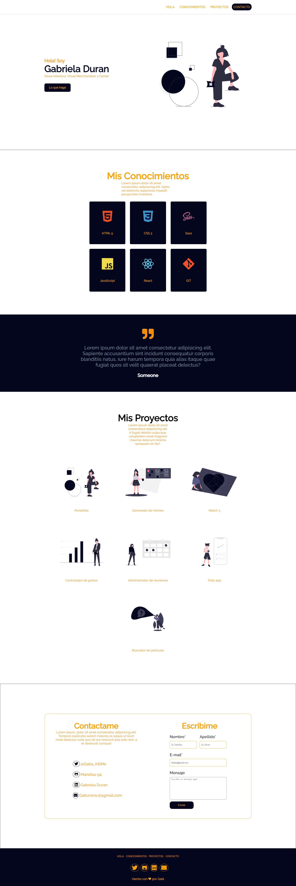

# Portafolio de Ada

### Para la visual de mi portafolio use como base el diseño que nos propuso ADA y le di una vuelta personal usando una paleta de colores de [coolors](https://coolors.co/palettes/trending) y las ilustraciones de [unDraw](https://undraw.co/illustrations). Priorise la elegancia del modelo que nos brindo ADA por lo que logre una page limpia, rapida y sencilla para facilitar la navegacion y experiencia del usuario. Considero que el éxito de un diseño web depende en gran medida de la aceptación entre los usuarios por lo que espero les guste mucho.

***
<br>

### Para poder ver mi trabajo hace click en el siguiente [enlace](mandisa-94.github.io/portafolio/.) o tambien podes verlo por [aqui](https://portafolio-gabriela-duran.netlify.app/)

***
<br>

### Si queres tener el codigo en tu pc tenes que seguir estos pasos en tu termunal.

- Ir al [Repositorio](https://github.com/Mandisa-94/Portafolio)

- Darle click al boton de forkear

- Darle click al boton de code

- Copiar la url

-Abrir tu terminal y poner el comando de 
```
git clone <url>
```
- Entrar a la carpeta del proyecto y abrirlo en tu IDE (editor de codigo).

### Este proyecto no necesita la instalacion de ninguna dependencia, por ahora.

***
<br>

### Asi debe verse el resultado: 



***
<br>

### Este proyecto fue desarrollado para [ADA](https://www.linkedin.com/school/ada-itw/) con el fin de tener en un portafolio con los trabajos que realice a lo largo de mi cursada para mostrarme al mercado laboral. Agradezco a [Jonh Parra](https://www.linkedin.com/in/jonathanparrazavala/) por sus excelentes clases e iniciarme en el mundo de la programacion.

#### [Gabriela Duran](https://www.linkedin.com/in/gabriela-duran94/)🎀


